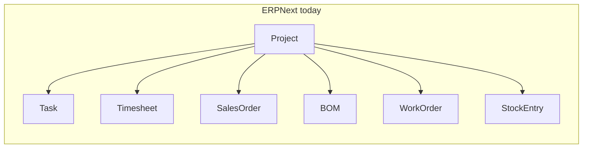
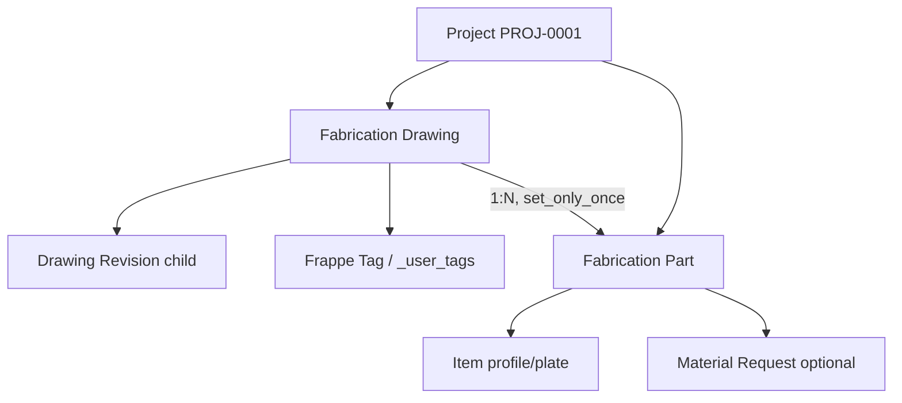

# 00 — Fabrication drawings on ERPNext Project

Status: not started. Track in [PROGRESS.md](PROGRESS.md).

Keep ERPNext Project as the job/costing container. Add Fabrication Drawing and Fabrication Part in FabTrk so a project can hold revisioned drawings, piece marks, and a raw-material takeoff — without inventing a second Project or a shop-floor MES.

## What ERPNext Project already is (and is not)

ERPNext **Project** ([`erpnext/projects/doctype/project/project.json`](../../erpnext/erpnext/projects/doctype/project/project.json)) is a **job + costing dimension**, not a fabrication register.

It holds: name, status, type, template, dates, customer, sales order, users, notes, and rolled-up money/time (timesheets, purchase, sales, stock). **Task** is the work-breakdown (nested, Gantt, % complete). **Timesheet** is hours. Generic **File** attachments exist on every document — they are not drawings (no drawing no, revision, hold, or part list).

Project is already a field on manufacturing/stock/sales docs (BOM, Work Order, Stock Entry, Material Request, Delivery Note, etc.). The dashboard in [`project_dashboard.py`](../../erpnext/erpnext/projects/doctype/project/project_dashboard.py) surfaces Task, Timesheet, BOM, Work Order, SO/DN/PO.

**Gap:** nothing in ERPNext or FabTrk models “drawing 101 rev R1 contains piece marks B1, C-12, each a length of a stock Item.” FabTrk is still an empty app ([`fabtrk/hooks.py`](../fabtrk/hooks.py), no DocTypes).

We will **not** replace Project. We will **link** fabrication documents to it (same pattern as Task).

## Decisions from grilling (locked)

- **Part** = project/drawing piece mark (cut from stock). Not itself a warehouse SKU.
- **Item** = one **stock unit**. In the warehouse it is already distinguished by material type + section + grade + thickness (those live in item code / name / description). Rod 40 vs Rod 60 are **different Items** — bar diameter belongs on the SKU, not on the part. One Item per combo. Fabrication Part only **Links** that Item. **No** extra Item fields and **no** Item Variants in v1. Thickness, grade, section, material, bar diameter are never stored on the part.
- **Drawing** = first-class document (number, revision, status, files, part list). CAD/Tekla import is **not** v1.
- **Revision (drawing vs part):** A **drawing revision** is the sheet we received (file + letter, e.g. R1) — the envelope. **The change lives on the part.** Most marks stay as they are; only the affected marks are revised. Receiving R1 does **not** copy, hold, or rewrite parts. Unchanged parts keep `revised_in` = R0. For a changed mark: keep **one** Fabrication Part per piece mark (identity). Freeze the old numbers into child table **Fabrication Part History**, then edit current qty/item/length/weight and set `revised_in` to the drawing’s current revision. Explicit **Revise Part** (button) — not auto on every save. Takeoff uses **current** part fields only. As-of-R0 takeoff report is **not** v1 (history is stored so it can be built later). Manual `on_hold` still, if the old piece is already in process. No second B1 document, no unique(piece_mark, revision) as two Parts (that would break 1:N identity).
- **v1** = drawing register + parts linked to Item + length/weight (material takeoff). No shop stations, no part status workflow, no weldment BOM.
- **Intake** = manual entry + attach PDF/DWG. CSV/Tekla later.
- **Drawing qty** = how many times this drawing is fabricated (default 1). **Integer only** (not Float) — you cannot fabricate 1.5 copies. Piece-mark qty is **per one drawing** and may stay Float. Job total for a mark = `drawing.qty × part.qty`. Takeoff and Material Request use that product. Never type job totals on the part.
- **Dates:** `drawing_date` = date printed on the sheet. `received_on` = date we received it. Fabrication clock starts at `received_on`, not `drawing_date`. Conversion-time report is **not** v1 (needs packing/dispatch later). Store the two dates now so that report can exist later.
- **Customer PO line:** typed fields on the drawing — `customer_po_no`, `po_line_no`, `po_weight` (contract/total weight on that line). **`po_weight` is always in kilograms** — label **PO Weight (kg)**. No UOM field and no other unit. No live link to Sales Order or Purchase Order Item in v1. Packing list later **prints** `po_line_no`; do not build packing list now. `po_weight` is the PO figure; takeoff weight from parts is separate (do not overwrite one with the other).
- **Phase / tags:** a drawing can have **multiple** tags (Phase 1 and a hold-bucket, or Phase 1 + Phase 2 if the customer overlaps). Not a from–to drawing-number range — numbers are not reliable integers. Use **Frappe system tags** on the drawing (form sidebar Tags, stored in `_user_tags` / Tag Link). Type “Phase 1”; the Tag master already exists in Frappe. **No** Fabrication Tag DocType, **no** Table MultiSelect child, **no** extra table. One `priority` Select on the drawing (Low / Medium / High / Urgent) applies to the whole drawing, not per tag. No bulk “drawings 1–100” tool and no custom Set Phase dialog in v1; assign in the form sidebar or via Data Import of tags.
- **UDF 1–5:** five Data fields `udf_1` … `udf_5` (labels **UDF 1** … **UDF 5**), `in_standard_filter`, not required. Empty is fine. For import/filter-only extras (location, etc.). **No UDF engine**, no child-table of label/value, no Customize-Form-in-code. If five are not enough later, use Frappe Custom Field — do not add UDF 6 in the app until they ask.
- **Parent / child:** Drawing is parent, Part is child. **1:N only** — one drawing, many parts; a part has exactly one drawing. Not a child table (istable): Fabrication Part stays its own DocType with required `drawing` (same pattern as Task → Project) so the project Parts list and takeoff work. `drawing` is `set_only_once` (wrong parent → delete and recreate; no reparent, no stale name). No many-to-many, no part shared across drawings. `project` is fetched from the drawing, not chosen separately.
- **Part source:** Select on the part, three values only — **Fabricate** / **Client Supplied** / **Bought Out**. Default Fabricate. Takeoff lists all three (filter by source). **Create Material Request** skips Client Supplied (and parts with no Item). Fabricate and Bought Out both go on the same Purchase MR using the part’s Item. No Subcontract in v1.
- **Part list line:** `line_no` (Int, reqd) — serial number on **this drawing’s part list**, not a customer PO line. Unique together with drawing. Drawing still has `customer_po_no` / `po_line_no` for the customer PO. Packing list later can print drawing PO line + part `line_no`.
- **Dimensions:** `dimension_type` Select — **1D** (`length` only: ISA, channel, **rod/bar** — cut length; section/bar dia is the Item) / **2D** (`length` + `width`: rectangular plate cut; thickness is the Item) / **Disc** (`diameter` only: circular piece cut from plate; thickness is the Item). Unused fields `depends_on` hidden. `length_uom` is the UOM for whichever cut measures show. **Weight stays typed**; do not compute weight from dims in v1. History snapshot includes these dim fields. Diameter is **not** for rods.

## v1 data model

DocTypes in module **Fabtrk**: Fabrication Drawing, Fabrication Part, plus one child table (revisions). Tags are Frappe system tags, not a FabTrk DocType.

**Fabrication Drawing** (standalone, like Task)

- `project` (Link Project, reqd)
- `drawing_no` (Data, reqd) — unique together with project
- `description` (Data) — label **Description**
- `status` (Select): Draft / Issued / On Hold / Superseded
- `qty` (Int, reqd, default 1) — copies of this drawing to fabricate; whole number > 0
- `drawing_date` (Date) — date written on the drawing
- `received_on` (Date) — date we received it (shop clock starts here)
- `customer_po_no` (Data)
- `po_line_no` (Data) — line item on that PO; packing list will print this later
- `po_weight` (Float) — total/contract weight on that PO line, **always kg**; label **PO Weight (kg)**; not computed from parts
- `priority` (Select): Low / Medium / High / Urgent — within the tagged phases; one value per drawing
- system tags — phases and any other buckets; many per drawing (Frappe Tags sidebar, not a field)
- `udf_1` … `udf_5` (Data) — labels UDF 1–5; optional filter/import slots; leave blank if unused
- `current_revision` (Data, read-only, set from child)
- `revisions` (Table **Drawing Revision**)
- autoname: `{project}-{drawing_no}`

**Drawing Revision** (istable)

- `revision` (Data, reqd) e.g. R0, A
- `drawing_file` (Attach)
- `issued_on` (Date)
- `notes` (Small Text)
- `is_current` (Check) — exactly one current per drawing

**Fabrication Part** (standalone — needed for project-wide takeoff and later tracking)

- `project` (Link, reqd, fetched from drawing)
- `drawing` (Link Fabrication Drawing, reqd, set_only_once) — exactly one parent; not an istable row
- `piece_mark` (Data, reqd) — unique with project + drawing
- `line_no` (Int, reqd) — serial on this drawing’s part list; unique with drawing
- `source` (Select, reqd, default Fabricate): Fabricate / Client Supplied / Bought Out
- `qty` (Float, reqd, default 1) — count **per one drawing**, not the job total
- `item` (Link Item) — not reqd so the register can be typed before items exist
- `dimension_type` (Select, reqd, default 1D): 1D / 2D / Disc
- `length` (Float) — 1D and 2D
- `length_uom` (Link UOM) — UOM for the visible cut measures
- `width` (Float) — 2D only
- `diameter` (Float) — Disc only (circular plate cut, not rod)
- `weight` (Float) — per piece, typed; takeoff uses `drawing.qty * part.qty * weight`
- `revised_in` (Data, read-only) — drawing revision letter last applied to this mark; set on insert from drawing `current_revision`
- `on_hold` (Check)
- `hold_reason` (Small Text)
- `history` (Table **Fabrication Part History**)
- autoname: `{project}-{drawing_no}-{piece_mark}` (fetch drawing_no)

**Fabrication Part History** (istable)

- `revision` (Data, reqd) — frozen drawing revision (e.g. R0)
- `qty` / `item` / `source` / `dimension_type` / `length` / `length_uom` / `width` / `diameter` / `weight` — snapshot of current fields **before** the revise
- `frozen_on` (Datetime, read-only)

**Revise Part** (button on Part, whitelisted): require drawing to have a current revision ≠ `revised_in`. Append one history row from current fields + old `revised_in`. Leave current fields for the user to edit. Set `revised_in` = drawing `current_revision`. Do not hold automatically. Calling Revise twice on the same current drawing revision is an error (already revised in R1).

Controller rules (keep small): unique piece mark per drawing (not per revision); only one `is_current` drawing revision; new drawing revision does **not** auto-hold or auto-revise parts; cannot delete a drawing that has parts; cannot save a part without `drawing`; cannot point one part at two drawings.

**Project:** no new custom fields. Override dashboard so Connections shows Fabrication Drawing and Fabrication Part ([`override_doctype_dashboards`](../fabtrk/hooks.py) commented stub already). Set `required_apps = ["erpnext"]`.

## Tracer bullet (all layers)

One path a user can run on `fxl.localhost`:

1. Open an ERPNext Project.
2. New **Fabrication Drawing** `101`, attach PDF as revision R0, status Issued. Fill `description`, `drawing_date` (e.g. 1 Jan), `received_on` (e.g. 1 Apr), `customer_po_no`, `po_line_no`, `po_weight` in kg from the customer PO line. Tag **Phase 1** from the form Tags sidebar, set `priority` High, leave UDFs empty (or put location in UDF 1).
3. Set drawing **qty** (e.g. 10, same as the PO line qty). Add parts `line_no` 1 `B1` (Fabricate, 1D rod/ISA, length only, Item = Rod 40) / `line_no` 2 `C-12` (Bought Out) / `line_no` 3 a plate rectangle (2D, length×width) / `line_no` 4 a circular plate cut (Disc, diameter only). Job totals = drawing.qty × part.qty — do not store those on the part. `po_weight` stays the drawing PO number; part weights are takeoff.
4. Add drawing revision R1 file (mark current). B2/C-12 untouched. On `B1`: **Revise Part** (history row freezes R0 qty/weight), change qty/weight, optionally tick `on_hold` if R0 was already in process.
5. Open report **Project Material Takeoff**: group by Item; include `source` and `line_no`. Sum `drawing.qty * part.qty`, length/weight products. Flag parts with no Item. Include all sources by default; highlight holds. Changing drawing qty later changes the report; it does **not** rewrite an existing Material Request.
6. Button on the report (or Drawing): **Create Material Request** for mapped items with source Fabricate or Bought Out (skip Client Supplied and no Item) using those multiplied totals, `material_request_type = Purchase`, `project` set. That is the ERPNext spine, not a second inventory system.

Desk only. No Vue app. No CAD parser.

## Files (create via JSON + migrate; do not mkdir DocType folders)

- [`fabtrk/hooks.py`](../fabtrk/hooks.py) — `required_apps`, dashboard override
- `fabtrk/fabtrk/doctype/fabrication_drawing/fabrication_drawing.json` + `.py` + `.js`
- `fabtrk/fabtrk/doctype/drawing_revision/drawing_revision.json`
- `fabtrk/fabtrk/doctype/fabrication_part/fabrication_part.json` + `.py` + `.js`
- `fabtrk/fabtrk/doctype/fabrication_part_history/fabrication_part_history.json`
- `fabtrk/fabtrk/report/project_material_takeoff/` — query report
- `fabtrk/fabtrk/project_dashboard.py` — merge fabrication links into Project Connections
- Workspace link under Fabtrk (Drawing, Part, Takeoff). No Tag shortcut — tags live on the drawing form.
- Standard Desktop Icon + Workspace Sidebar (`fabtrk/desktop_icon/`, `fabtrk/workspace_sidebar/`) so the Fabtrk tile appears on Desk after install
- Tests: unique constraints, current revision, takeoff totals, MR lines from parts, Revise Part freezes history and blocks double-revise on same drawing rev

## Explicitly out of v1

- Shop-floor status / stations / quantities at cut-fit-weld-paint-ship
- Auto revision delta / recut / auto-revise all parts when drawing R1 is received
- As-of-revision takeoff (history is stored; report later)
- Two Fabrication Part documents for the same piece mark (B1-R0 and B1-R1)
- Tekla/SDS2/CSV import
- Piece mark as ERPNext Item or per-part BOM
- Replacing or subclassing Project
- Custom Project child table of files
- Live link to Sales Order Item / Purchase Order Item
- Packing list DocType (will read `po_line_no` when built)
- Conversion-time report (`received_on` → dispatch)
- Drawing-number range → phase (1–100) as a rule engine
- UDF framework / label-value child table / Custom Field generator
- Dedicated Location master; use UDF 1 (or a later Custom Field) if needed
- Custom bulk “Set Phase on selected rows” dialog (use form tags + Data Import)
- Fabrication Tag / Fabrication Drawing Tag DocTypes (use Frappe system tags)
- Subcontract / fourth source
- Thickness on the part (it belongs on the Item)
- Diameter on a rod/bar part (Rod 40 vs 60 is the Item; part is 1D length)
- Length + diameter together (old “Round” type)
- Custom fields or Item Variants for material / section / grade / thickness (encode in item code)
- Weight calculated from L×W or from density
- Customer PO line copied onto every part (part `line_no` is the drawing BOM serial only)

CSV import (CAD/Tekla), packing list, conversion report, and a single part **status** field are the obvious v2; do not scaffold them now.
